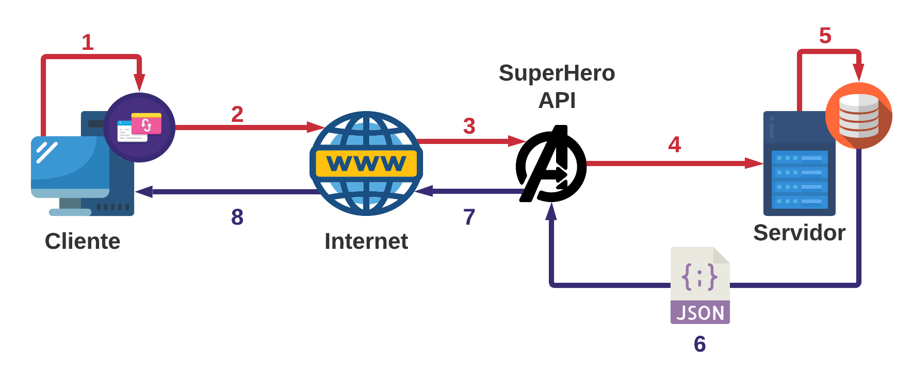
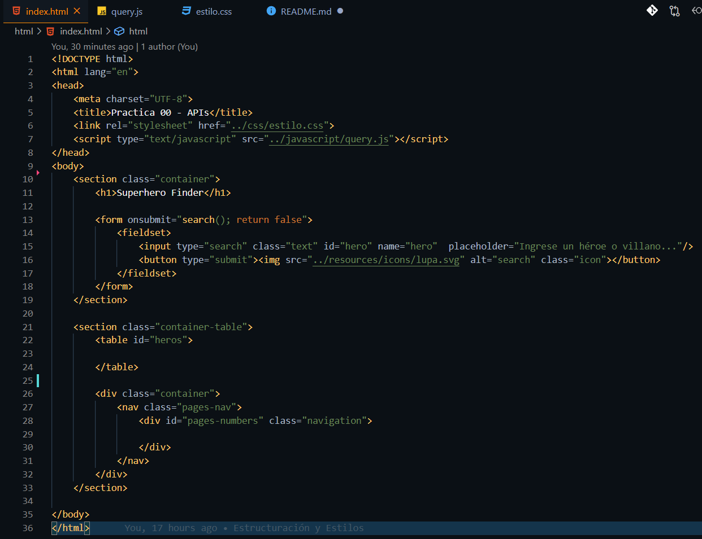
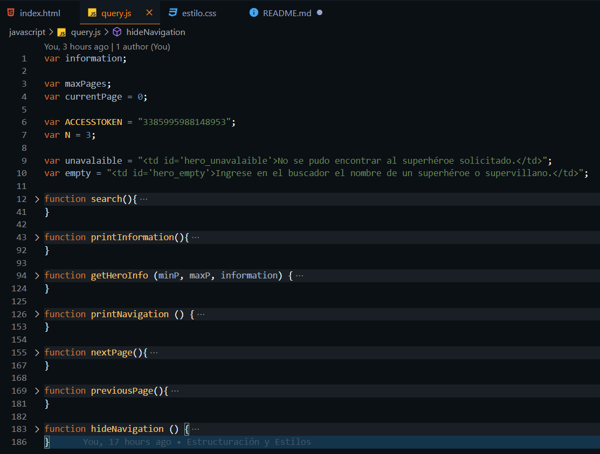
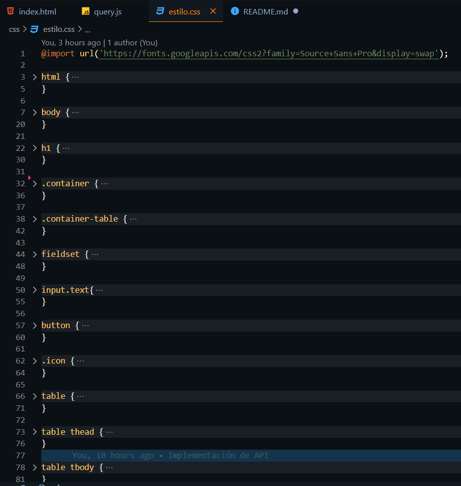
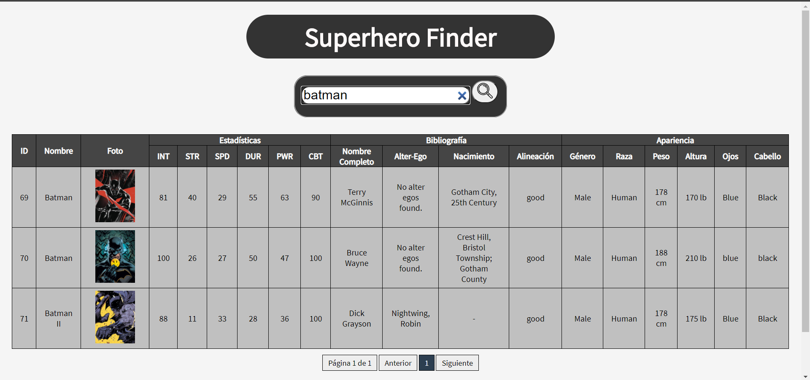

# Practica00 - Consumo De APIs En La Nube

Práctica de Plataformas Web en donde se aplican conocimientos de programación hipermedial aplicado al consumo de servicios de la nube.

**PRÁCTICA DE LABORATORIO**

**CARRERA** : Computación

**ASIGNATURA** : Plataformas Web

**TÍTULO PRÁCTICA** : Desarrollo de una aplicación web utilizando una API.

**OBJETIVOS ALCANZADOS** :

> - Conocer las arquitecturas y patrones arquitectónicos web para el diseño de aplicaciones web.
> - Interactuar con servicios web de plataformas en la nube.

**ACTIVIDADES DESARROLLADAS**

<h3><strong>1.	Identificar gráficamente la arquitectura y el patrón de diseño de la aplicación a desarrollar. </strong></h3>

La arquitectura propuesta para el desarrollo de la aplicación sigue una arquitectura del tipo “Cliente – Servidor”, en la cuál se establece una conexión a través de internet gracias a varias herramientas. La misma se puede visualizar con mayor detalle en la siguiente figura.

**Explicación:**  
> **1.-** El usuario, a través de un cliente (navegador), con la ayuda de herramientas como AJAX realizan la búsqueda de un superhéroe a través de una petición.  
> **2.-** Se establece una conexión a través de internet, mediante diversos protocolos como HTTP.  
> **3.-** La SuperHero API, recibe la petición de búsqueda, en este caso con el “nombre” del superhéroe o villano.  
> **4.-** La API procesa la solicitud y la envía hacia el servidor donde se encuentra alojado.  
> **5.-** El servidor a través de su Base de Datos, prepara toda la información que sea concordante con el término de búsqueda.  
> **6.-** La información es recopilada en un archivo de formato JSON, la cuál es recibida por la API.  
> **7.-** La API, igualmente a través de la internet responde a la petición del Cliente enviando los datos recopilados.  
> **8.-** El Cliente recibe el archivo JSON, y mediante el navegador y herramientas como JS, CSS y HTML se le presenta la información al usuario de una manera que sea sencilla y comprensible.

<h3><strong>2. Generar una llave para consumir los servicios web de la API (opcional, depende de la API seleccionada). </strong></h3>

Para la presente aplicación, se necesitó obtener un Access Token mediante el registro con Facebook, para poder utilizar todos los servicios de <a href="https://superheroapi.com/">la API.</a>

<h3><strong>3.	Desarrollar una aplicación con HTML + CSS + Javascript + Web Services para buscar información y visualizar toda la información disponible a través de la API. </strong></h3>

**HTML**

La estructura usada para la aplicación, fue sencilla. Dos secciones, una en la cual se encuentra el título y el formulario que permite la búsqueda. En la segunda se encuentra la tabla sobre la cual se presentan los datos, así como la barra de navegación entre páginas.

**JavaScript**

Para estructurar de mejor manera el proceso de obtención de datos, se dividió el proceso en varios funciones. Las primeras 3 se enfocan en realizar la petición de información a la API, así como la presentación del mismo. Las últimas se enfocan en administrar la visualización y actualización de la navegación entre páginas.

**CSS**

Se estableció una hoja de estilos propia, en la cual se presenta un estilo enfocado al minimalismo y tratando de no mostrar demasiados colores. El enfoque fue una combinación de blancos y tonos de grises.

**Aplicación**

El resultado final es una aplicación web que presenta la información de la API, en este caso, información acerca de algunos superhéroes y supervillanos de varias editoriales de cómics.

<h4>

**Nota:** Los iconos utilizados para realizar el diagrama presentado, se obtuvieron de Flaticon.es, dentro del repositorio se encuentra un HTML sencillo en donde se presenta a los autores de los mismos.

</h4>

**RESULTADO(S) OBTENIDO(S)**:

> - Se logró identificar diversas arquitecturas y diseños de desarrollo de aplicaciones web.
> - Se logró implementar una aplicación web que se comunique con servicios en la nube.
> - Se logró comprender el funcionamiento detrás del consumo de APIs mediante aplicaciones web.

**CONCLUSIONES** :

> - Las APIs (Interfaces de Programación de Aplicaciones) permiten a los desarrolladores acceder a ciertos servicios de un sitio web de una manera en la que se abstrae de gran medida el proceso.
> - Las plataformas web permiten a los usuarios acceder a varios tipos de servicios, tanto como para entretenimiento, educación o para trabajos.

**RECOMENDACIONES** :

> - Haber asistido a las sesiones de clase.
> - Revisar el contenido teórico del tema.
> - Realizar las preguntas respectivas al docente a cargo.
> - Aplicar buenas prácticas de programación y diseño.

**Estudiante:** Sarmiento Douglas Bryan Sarmiento.
